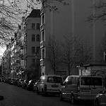
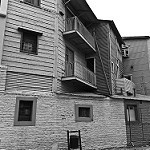
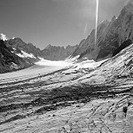

# Tugas-Autoencoder-DeepLearning-A-3038

# 🎨 Autoencoder untuk Pewarnaan Citra Grayscale

Repositori ini merupakan implementasi dari model **autoencoder** untuk menyelesaikan permasalahan *image colorization* (pewarnaan citra dari grayscale ke RGB) sebagai tugas mata kuliah **Deep Learning**.

---

## 📁 Dataset

Dataset yang digunakan adalah dataset **landscape** berisi gambar pemandangan berwarna dan versi grayscale-nya. Dataset disusun sebagai berikut:

- Jumlah data: 200 pasang gambar
- Format: `.jpg`
- Resolusi citra diubah ke `(128, 128)` piksel
  
Contoh pasangan input dan ouput citra:

| Grayscale (`gray.jpg`) | Warna Asli (`color.jpg`) |
|--------------------------|-----------------------------|
|  |  |
|  |  |
|  |  |
|  |  |
|  |  |

- **Input (Gray)**: Citra grayscale (hitam-putih) yang diberikan ke model.
- **Predicted Output**: Citra berwarna yang dihasilkan oleh model berdasarkan citra grayscale.
- **Target (Color)**: Citra berwarna asli yang digunakan sebagai target selama pelatihan.
---

## 🧠 Arsitektur Autoencoder

Model autoencoder yang digunakan terdiri dari dua bagian utama:

### 🔻 Encoder
Encoder berfungsi untuk mengompresi gambar grayscale menjadi representasi yang lebih kecil (low-dimensional) menggunakan layer konvolusi:
- `Conv2D` → `MaxPooling2D`
- **Layer 1**: Conv2D dengan 64 filter, kernel (3,3), aktivasi ReLU, padding "same".
- **Layer 2**: MaxPooling2D dengan ukuran pool (2,2), padding "same".
- **Layer 3**: Conv2D dengan 128 filter, kernel (3,3), aktivasi ReLU, padding "same".
- **Layer 4**: MaxPooling2D dengan ukuran pool (2,2), padding "same".
- Digunakan sebanyak 3 blok

### 🔺 Decoder
Decoder bertugas untuk merekonstruksi gambar dari representasi yang lebih kecil menjadi gambar berwarna melalui:
- `Conv2D` → `UpSampling2D`
- **Layer 1**: Conv2D dengan 128 filter, kernel (3,3), aktivasi ReLU, padding "same".
- **Layer 2**: UpSampling2D dengan ukuran (2,2).
- **Layer 3**: Conv2D dengan 64 filter, kernel (3,3), aktivasi ReLU, padding "same".
- **Layer 4**: UpSampling2D dengan ukuran (2,2).
- **Layer 5**: Conv2D dengan 3 filter (untuk channel RGB), kernel (3,3), aktivasi sigmoid, padding "same".
- Digunakan sebanyak 3 blok

**Input**: Citra grayscale `(128, 128, 1)`  
**Output**: Citra RGB hasil prediksi `(128, 128, 3)`

Model ini dioptimalkan menggunakan **Adam Optimizer** dan menggunakan **Mean Squared Error (MSE)** sebagai fungsi loss.

---

## ⚙️ Training dan Evaluasi

- **Loss Function**: Mean Squared Error (MSE)
- **Optimizer**: Adam
- **Epochs**: 50
- **Batch Size**: 16

Selama pelatihan, model berhasil menurunkan nilai loss secara bertahap.

### Proses Pelatihan
Model autoencoder dilatih selama **10 epoch** dengan batch size **8** dan split data validasi sebesar 10%. Data yang digunakan untuk pelatihan adalah gambar grayscale sebagai input dan gambar berwarna sebagai target output.

### Performa Model (Loss)
Pada pelatihan, model mengalami konvergensi dengan penurunan nilai loss yang signifikan. Nilai loss ini diukur menggunakan **Mean Squared Error (MSE)**, yang mengukur perbedaan antara citra output yang dihasilkan oleh model dengan citra target yang sebenarnya.

Nilai loss yang dihasilkan model selama pelatihan mengalami penurunan yang stabil, menunjukkan bahwa model belajar dengan baik untuk menghasilkan gambar berwarna yang mendekati gambar target.
- Penurunan Loss yang Konsisten:
Selama 10 epoch, model menunjukkan penurunan training loss dari 0.0625 ke 0.0105 dan validation loss dari 0.0220 ke 0.0085. Penurunan ini menunjukkan bahwa model berhasil belajar secara efektif untuk menghasilkan gambar yang lebih mendekati target.
- Rata-rata Loss:
Rata-rata training loss selama 10 epoch adalah 0.0152, sedangkan rata-rata validation loss adalah 0.0111. Nilai ini menunjukkan performa yang cukup baik, dengan model mampu mengeneralisasi pada data validasi tanpa mengalami overfitting.

Dengan rata-rata loss yang relatif rendah, model sudah cukup berhasil melakukan pewarnaan gambar, meskipun ada ruang untuk perbaikan lebih lanjut.
