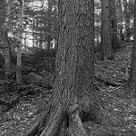
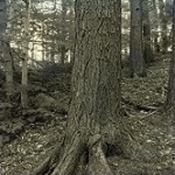
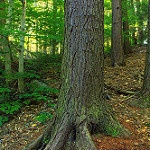
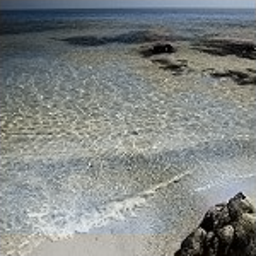
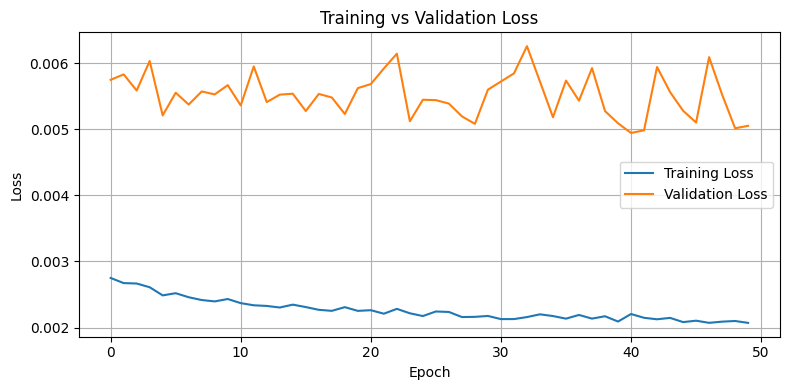

# Tugas-Autoencoder-DeepLearning-A-3038

# 🎨 Autoencoder untuk Pewarnaan Citra Grayscale

Repositori ini merupakan implementasi dari model **autoencoder** untuk menyelesaikan permasalahan *image colorization* (pewarnaan citra dari grayscale ke RGB) sebagai tugas mata kuliah **Deep Learning**.

---

## 📁 Dataset

Dataset yang digunakan adalah: **Landscape color and grayscale images** dari Kaggle yang berisi gambar pemandangan berwarna dan versi grayscale-nya. Dataset disusun sebagai berikut:

- Jumlah data: 200 pasang gambar
- Format: `.jpg`
- Resolusi citra diubah ke `(128, 128)` piksel

Struktur folder:
```
dataset/
├── color/    # berisi citra RGB (target)
├── gray/     # berisi citra grayscale (input, hanya digunakan untuk referensi visual)
```
  
## 🖼️ Contoh Hasil
Berikut adalah hasil colorization oleh model autoencoder:

| Input (Grayscale) | Predicted (Colorized) | Target (Asli Berwarna) |
|-------------------|------------------------|--------------------------|
|  |  |  |
|  |  |  |
|  |  |  |
|  |  |  |
|  |  |  |

> Catatan: hasil citra berwarna yang diprediksi disimpan secara otomatis ke dalam folder `output/predicted/`

- **Input (Gray)**: Citra grayscale (hitam-putih) yang diberikan ke model.
- **Predicted Output**: Citra berwarna yang dihasilkan oleh model berdasarkan citra grayscale.
- **Target (Color)**: Citra berwarna asli yang digunakan sebagai target selama pelatihan.
---

## 🧠 Arsitektur Autoencoder

Model autoencoder yang digunakan terdiri dari dua bagian utama:
- **Encoder**: 3 lapis Conv2D + MaxPooling2D
- **Decoder**: 3 lapis Conv2D + UpSampling2D
- Output layer: Conv2D dengan 2 filter (untuk kanal a dan b LAB)


### 🔻 Encoder
Encoder berfungsi untuk mengompresi gambar grayscale menjadi representasi yang lebih kecil (low-dimensional) menggunakan layer konvolusi:
- `Conv2D` → `MaxPooling2D`
- **Layer 1**: Conv2D dengan 64 filter, kernel (3,3), aktivasi ReLU, padding "same".
- **Layer 2**: MaxPooling2D dengan ukuran pool (2,2), padding "same".
- **Layer 3**: Conv2D dengan 128 filter, kernel (3,3), aktivasi ReLU, padding "same".
- **Layer 4**: MaxPooling2D dengan ukuran pool (2,2), padding "same".
- Digunakan sebanyak 3 blok


### 🔺 Decoder
Decoder bertugas untuk merekonstruksi gambar dari representasi yang lebih kecil menjadi gambar berwarna melalui:
- `Conv2D` → `UpSampling2D`
- **Layer 1**: Conv2D dengan 128 filter, kernel (3,3), aktivasi ReLU, padding "same".
- **Layer 2**: UpSampling2D dengan ukuran (2,2).
- **Layer 3**: Conv2D dengan 64 filter, kernel (3,3), aktivasi ReLU, padding "same".
- **Layer 4**: UpSampling2D dengan ukuran (2,2).
- **Layer 5**: Conv2D dengan 3 filter (untuk channel RGB), kernel (3,3), aktivasi sigmoid, padding "same".
- Digunakan sebanyak 3 blok

**Input**: Citra grayscale `(128, 128, 1)`  
**Output**: Citra RGB hasil prediksi `(128, 128, 3)`

Model ini dioptimalkan menggunakan **Adam Optimizer** dan menggunakan **Mean Squared Error (MSE)** sebagai fungsi loss.

---

## ⚙️ Training dan Evaluasi

- Epochs: **50**
- Batch size: **8**
- Loss: **Mean Squared Error (MSE)**
- Optimizer: **Adam (lr = 1e-4)**

Selama pelatihan, model berhasil menurunkan nilai loss secara bertahap.

### Proses Pelatihan
Model autoencoder dilatih selama **10 epoch** dengan batch size **8** dan split data validasi sebesar 10%. Data yang digunakan untuk pelatihan adalah gambar grayscale sebagai input dan gambar berwarna sebagai target output.

### Performa Model (Loss)
Pada pelatihan, model mengalami konvergensi dengan penurunan nilai loss yang signifikan. Nilai loss ini diukur menggunakan **Mean Squared Error (MSE)**, yang mengukur perbedaan antara citra output yang dihasilkan oleh model dengan citra target yang sebenarnya.

### 📉 Loss Curve
Model autoencoder dilatih selama 50 epoch dengan data grayscale sebagai input dan RGB sebagai target. Fungsi loss yang digunakan adalah Mean Squared Error (MSE).





### 📊 Ringkasan Performa:
Loss awal: 0.0028

Val_loss awal: 0.0058

Loss akhir: 0.0021

Val_loss akhir: 0.0051

Val_loss terbaik: 0.0049 (pada epoch 41)

Model menunjukkan konvergensi yang stabil, meskipun masih terdapat sedikit fluktuasi pada nilai validation loss. Hal ini menunjukkan bahwa model mampu mempelajari representasi fitur dari citra grayscale untuk merekonstruksi warna meskipun dengan keterbatasan data dan kompleksitas.
